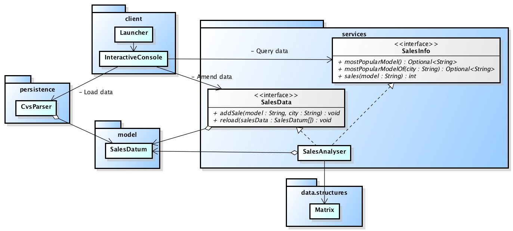

#Java Test Exercise: Car Sales#

## Instructions ##

A car manufacturer in the UK maintains a file that contains a list of all car models sold in a period of time for analysis purposes. The file contains a line entry for each individual car sold, by model & city.

Example (CSV format, including header line):
`Model, City`  
`Passat, London`  
`Golf, London`
`Passat, Bristol`  
`Sharan, Leeds`  
`Golf, London`

Using Java (version 7 or above) implement a sales based ranking, specifically providing execution of the following functionality from the command-line:

| Method | Purpose |
| ------------- |-------------|
| mostPopularModel() | Returns the most popular car model, that is, the model (or models) with the highest number of overall sales. |
| mostPopularModelOf(city) | Returns the most popular car model (or models) by a given city. |
| sales(model) | Returns the overall number of times a given car model has been sold nationwide. |


Do **not** use any 3rd party Java libraries or predefined Map or collection classes from the standard library (i.e. do not use List, Set, Queue or other java.util.Collection implementations). Other standard basic data structures, e.g. Array, are fine to use. Start all non-test code from scratch. You may however use a test framework (e.g. JUnit) for automated tests.

We would like to see a class diagram of your solution. It does not have to be pretty, a photograph of your drawings is enough.

Make sensible assumptions where necessary. Include a short explanation of your design and the decisions you made, together with a plain text “read me” file with the instructions to run your program.
Please bear in mind all the best practices you would normally employ when producing "done" production code:  
 
* Well structured code 
* Verified by tests 
* Readable & expressive code

### Update ###

Refactor to add an additional method:

| Method | Purpose |
| ------------- |-------------|
| sales(model, city) | Adds a car model, within the associated city, to the overall collection of cars sold |


## Execution ##

Example command-line execution (via Gradle):

```
gradle run -PappArgs="['./src/test/resources/model_city_sales_data.csv','New Passat','Leeds']"
```

### Example output ###

```
Most popular model = Golf
Total sales of car model: New Passat = 1
Most popular car model in city: Leeds = New Sharan
```


## Design ##

Overview of current implementation design:


